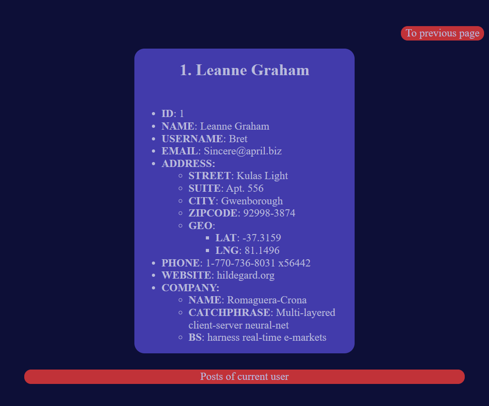

Mini project to show skills of using HTML, CSS and JS.

### The view of index.html

After click on button **Details** you will be redirected to user-details.html

### The view of user-details.html

After click on button **To previous** page you will be redirected to index.html

After click on button **Posts of current user** you will see all posts of current user

### The view of all posts of current user

After click on button **Return to info about user** you will be redirected to user-details.html

After click on button **Post details** you will be redirected to post-details.html

### The view of all posts of post-details.html

After click on button **To first page** you will be redirected to index.html

After click on button **To previous page** you will be redirected to user-details.html